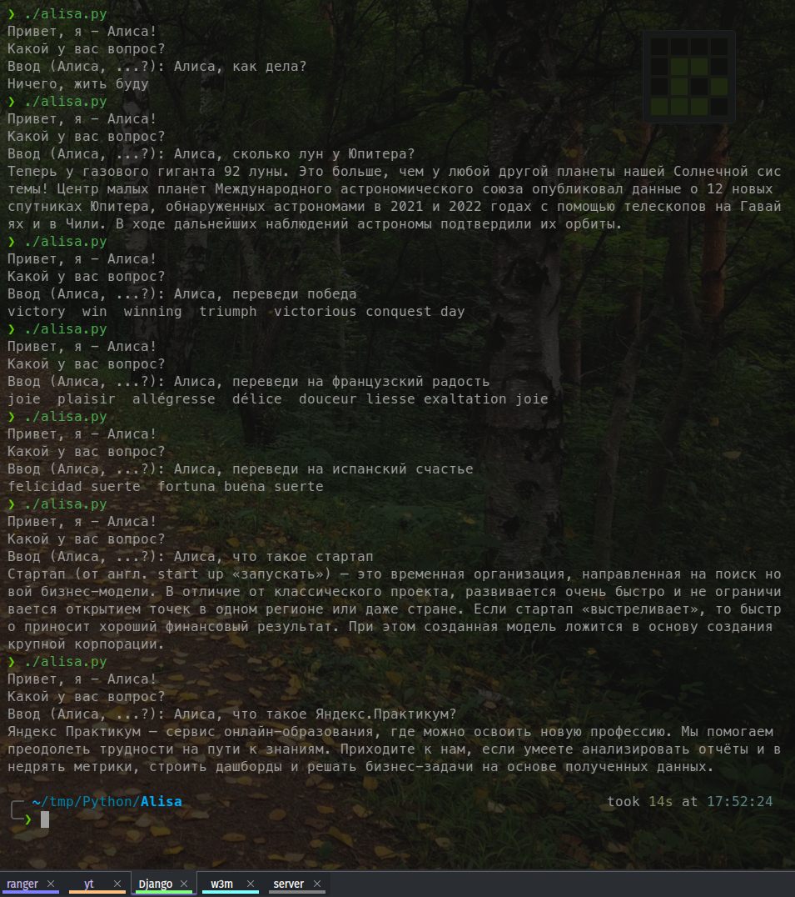
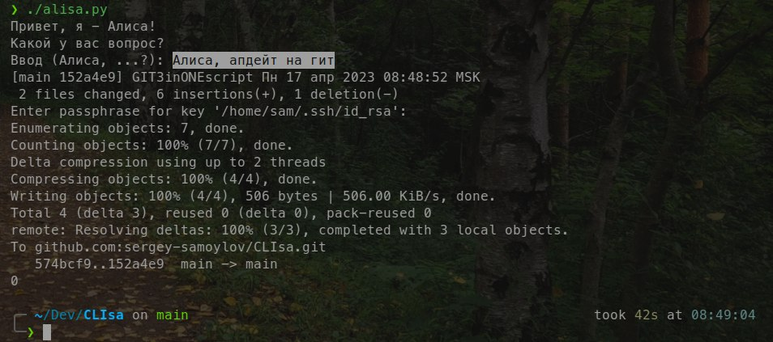

<pre>
 ____     __     ______                      
/\  _`\  /\ \   /\__  _\                     
\ \ \/\_\\ \ \  \/_/\ \/     ____     __     
 \ \ \/_/_\ \ \  __\ \ \    /',__\  /'__`\   
  \ \ \L\ \\ \ \L\ \\_\ \__/\__, `\/\ \L\.\_ 
   \ \____/ \ \____//\_____\/\____/\ \__/.\_\
    \/___/   \/___/ \/_____/\/___/  \/__/\/_/
                                             
</pre>

# CLIsa (CLI + Alisa)

+ Idea: What if you could combine power, speed and purity of Command Line Interface (CLI) and AI such as Alisa (Yandex)?

+ Inspiration: ChatGPT and alike, which are the future of web search were inspirational patterns for CLIsa project.

## CLIsa v.01 speaks Russian

Default language for this project is Russian. Others may follow on demand.

## CLIsa modules

By architecture it is modular program. It consists of several bolt-ons that are imported into main module.

This aproach allows you to easily add, modify or delete parts of CLIsa.

CLIsa's version v.01 can:

+ tell you current weather

+ suggest a password for any service and remember it

+ remind you the password for any of your services

+ tell time in different cities

+ tell you how many days passed from certain day in the past (say your birthday)

+ and ... one more thing :-) 

## CLIsa parsing

CLIsa can get you answers for different questions if these answers are in Yandex service.

Usually these are briefs on a subject that you might ask about. A few lines of text.

For most of the time, that's exactly what you've been looking for.

It is simple, quick and easy!

## CLIsa skill updates:

+ Learned translation to Arabic, Armenian and many other
+ Translation text limit 500 chars. (They were too wordy, for short answers)
+ Got shadow initiation file clisa.py to run from terminal with just "Алиса,"
+ Learned how to update myself on git

Consider giving a star, if you like CLIsa :-)
